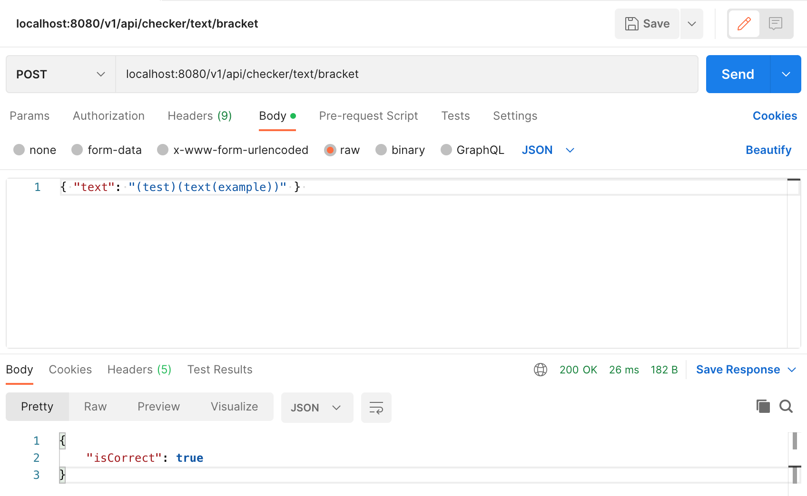
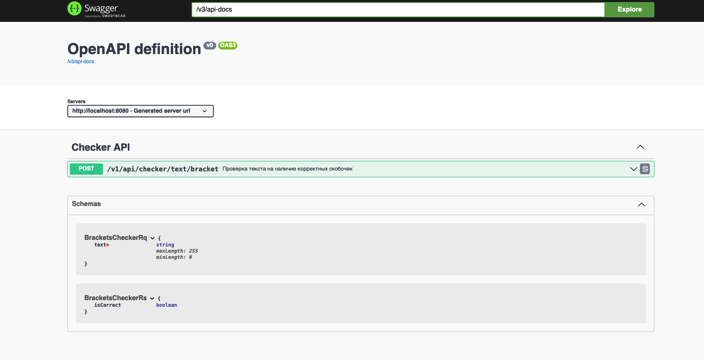

# Brackets Checker
 Проек для конкурса красоты от Sber по дисциплине Java.

## Features
Веб-приложение принимает на вход текст и выдает логический резульат который говорит о том, правильно ли расставлены скобки или нет. Учитывается также наполнен ли текст между скобками.



Документация по API расположена по адресу <host>/swagger-ui/index.html#/ после запуска

## Tech
- [Java]
- [Spring boot]

## Installation

Для запуска требуется Docker на машине где будет запускаться веб-приложение.

В корневой папке проекта запустите команду.
```sh
make build deploy
```
Веб-приложение запуститься по адресу localhost:8080. 

## Usage 
В тело запрооса передается текст по параметру text. В ответ приходит параметр isCorrect. Запрос передается POST методом по адресу localhost:8080/v1/api/checker/text/bracket
Подробная документация API доступна по адресу localhost:8080/swagger-ui/index.html#/ 

